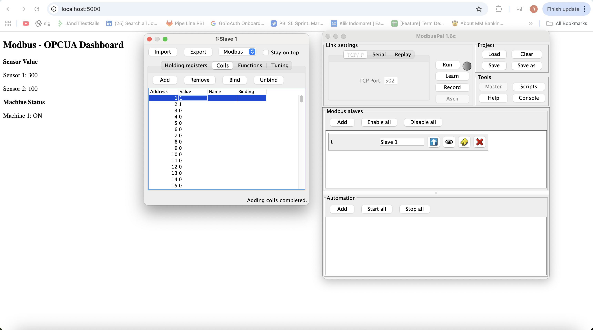
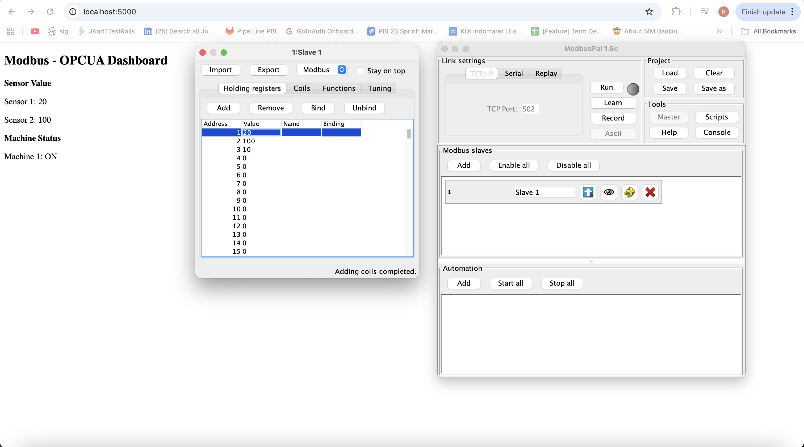
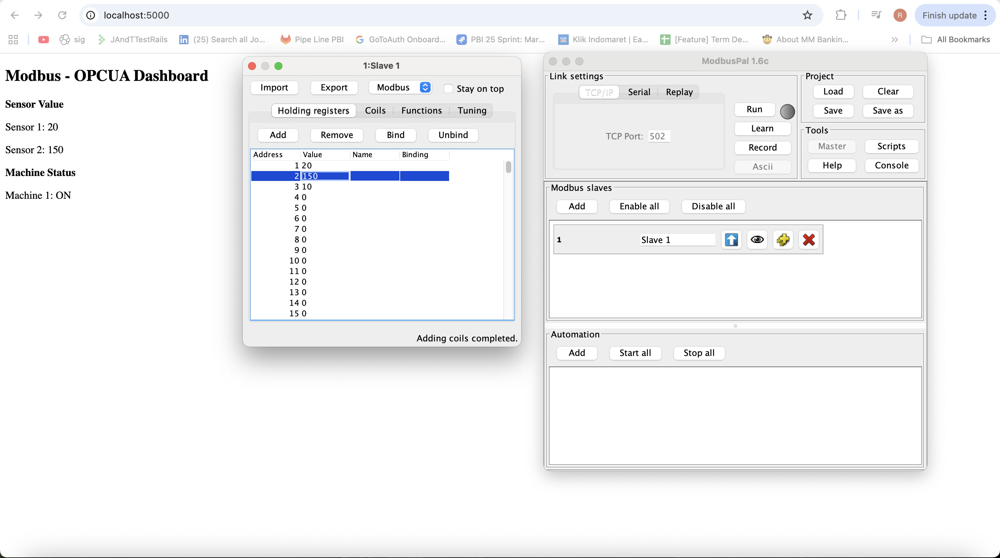

# Modbus-OPCUA-Server-Client
- This application is simulate how OPCUA Server read from modbus-TCP, and and call by OPCUA Client and broadcast the information to socket for update the web informations

# Running Application
- Run the Modbus simulator
    ```java -jar ModbusPalEnhanced-v1.7-standalone```
- Run the server
    ```python3 opc-ua-server.py```
- Run client
    ```python3 opc-ua-client.py```

# Screenshoots
- Read value coils
    
- Read value register 1
     
- Read value register 2
     